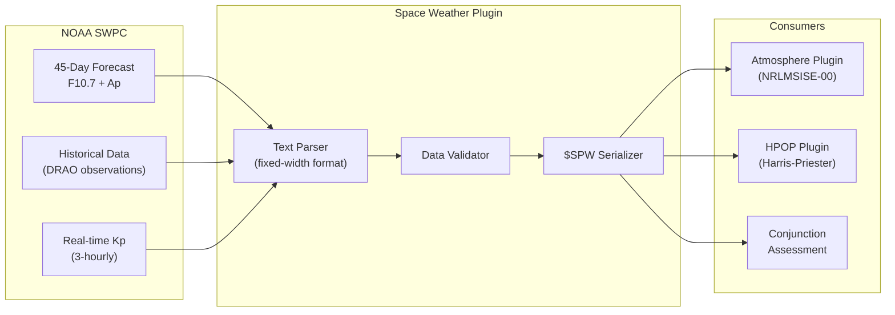

# ☀️ Space Weather Forecast Plugin

[](https://github.com/the-lobsternaut/space-weather-forecast-sdn-plugin/actions)
[](LICENSE)
[](https://en.cppreference.com/w/cpp/17)
[](wasm/)
[](https://github.com/the-lobsternaut)

**NOAA SWPC 45-day space weather forecasts — F10.7 solar flux, Ap geomagnetic index, and Kp predictions for atmospheric drag modeling and satellite operations.**

---

## Overview

The Space Weather Forecast plugin ingests the NOAA Space Weather Prediction Center's 45-day forecast and historical data, providing the solar and geomagnetic indices that drive atmospheric density models (NRLMSISE-00, Harris-Priester, JB2008) used throughout the SDN.

### Key Parameters

| Parameter | Unit | Description | Impact |
|-----------|------|-------------|--------|
| **F10.7** | sfu (10⁻²² W/m²/Hz) | 10.7 cm solar radio flux | Thermospheric heating |
| **F10.7A** | sfu | 81-day centered average | Long-term density trend |
| **Ap** | nT | Daily planetary geomagnetic index | Storm-time density enhancement |
| **Kp** | 0–9 | 3-hourly geomagnetic index | Short-term perturbations |

### Why It Matters

Solar activity is the dominant driver of thermospheric density variations at satellite altitudes. F10.7 can vary from ~65 sfu (solar minimum) to ~250 sfu (solar maximum), causing density changes of 10× or more at 400 km altitude. Accurate forecasts are essential for:

- Satellite drag prediction
- Conjunction assessment timing
- Reentry prediction
- GPS/GNSS error correction
- HF radio propagation forecasting

---

## Architecture



---

## Data Sources & APIs

| Source | URL | Update | Auth |
|--------|-----|--------|------|
| **SWPC 45-Day Forecast** | [services.swpc.noaa.gov/text/45-day-ap-forecast.txt](https://services.swpc.noaa.gov/text/45-day-ap-forecast.txt) | Daily | None |
| **CelesTrak Space Data** | [celestrak.org/SpaceData](https://celestrak.org/SpaceData/) | Hourly | None |
| **SWPC Historical** | [swpc.noaa.gov/products/solar-cycle-progression](https://www.swpc.noaa.gov/products/solar-cycle-progression) | Monthly | None |
| **DRAO** | [spaceweather.gc.ca](https://spaceweather.gc.ca/) | Daily | None |

---

## Research & References

- **NOAA SWPC** — [swpc.noaa.gov](https://www.swpc.noaa.gov/). Space Weather Prediction Center operations.
- Tapping, K. F. (2013). ["The 10.7 cm solar radio flux (F10.7)"](https://doi.org/10.1002/swe.20064). *Space Weather*, 11(7), 394–406. F10.7 solar flux measurement.
- Menvielle, M. & Berthelier, A. (1991). "The K-derived planetary indices." *Reviews of Geophysics*, 29(3). Kp/Ap index derivation.
- Picone, J. M. et al. (2002). "NRLMSISE-00 empirical model." Uses F10.7 and Ap as inputs.

---

## Technical Details

### Solar Cycle Context

| Cycle Phase | F10.7 (sfu) | Ap | Density at 400 km |
|------------|-------------|-----|-------------------|
| Deep minimum | 65–70 | 3–5 | ~10⁻¹³ kg/m³ |
| Rising phase | 100–150 | 10–20 | ~5×10⁻¹³ kg/m³ |
| Solar maximum | 200–250 | 20–50 | ~2×10⁻¹² kg/m³ |
| Geomagnetic storm | Any | 100–400 | 5–10× above quiet |

### Output Wire Format: `$SPW`

```
SpaceWeatherRecord:
  date (YYYYMMDD)
  F10.7_obs (sfu)        — observed F10.7
  F10.7_adj (sfu)        — adjusted to 1 AU
  F10.7A (sfu)           — 81-day centered average
  Ap_daily               — daily Ap index
  Kp[8]                  — 3-hourly Kp values
  source (obs/forecast)  — data provenance
```

---

## Build Instructions

```bash
git clone --recursive https://github.com/the-lobsternaut/space-weather-forecast-sdn-plugin.git
cd space-weather-forecast-sdn-plugin
mkdir -p build && cd build
cmake ../src/cpp -DCMAKE_CXX_STANDARD=17
make -j$(nproc) && ctest --output-on-failure
```

---

## Usage Examples

```cpp
#include "space_weather/parser.h"

auto records = spw::parse45DayForecast(forecast_text);
for (const auto& r : records) {
    printf("%s: F10.7=%.1f, F10.7A=%.1f, Ap=%d\n",
           r.date.c_str(), r.f107, r.f107a, r.ap);
}

// Feed to NRLMSISE-00
atmosphere::SolarActivity solar;
solar.F107 = records[0].f107;
solar.F107A = records[0].f107a;
solar.Ap[0] = records[0].ap;
auto density = atmosphere::nrlmsise00(pos, epoch, solar);
```

---

## Plugin Manifest

```json
{
  "schemaVersion": 1,
  "pluginType": "data-retrieval",
  "pluginId": "space-weather-forecast",
  "pluginName": "SWPC 45-Day Space Weather Forecast",
  "pluginVersion": "1.0.0",
  "description": "NOAA SWPC 45-day F10.7 and Ap forecasts for atmospheric density modeling.",
  "schema": { "code": "SPW", "fileIdentifier": "$SPW" }
}
```

---

## License

MIT — see [LICENSE](LICENSE) for details.

*Part of the [Space Data Network](https://github.com/the-lobsternaut) plugin ecosystem.*
